# 🏗️ ARQUITETURA & ROADMAP VISUAL

## 1. ARQUITETURA ATUAL (2026)

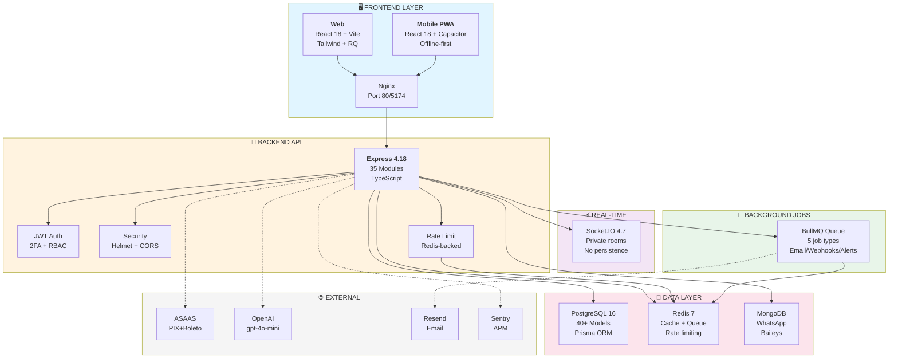

---

## 2. ROADMAP 12 MESES (FASEADO)

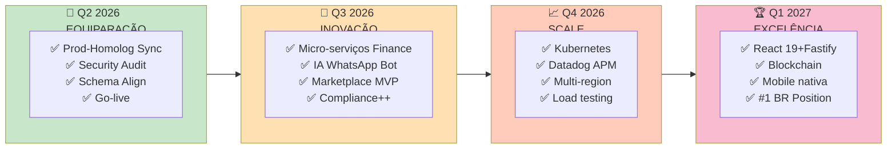

---

## 3. DECISÃO: 3 CENÁRIOS

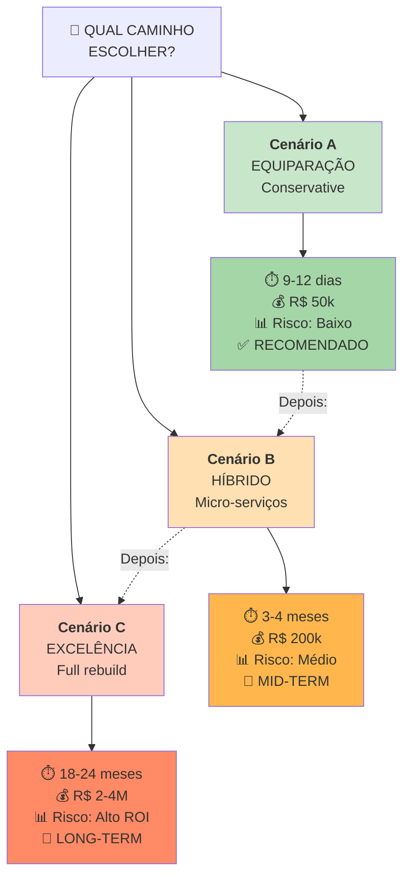

---

## 4. STACK EVOLUÇÃO

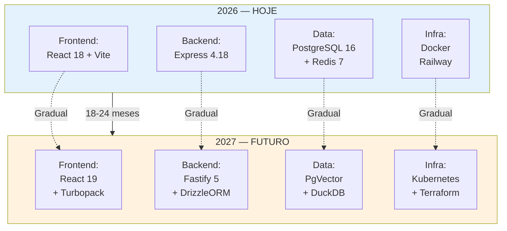

---

## 5. MARKET POSITIONING

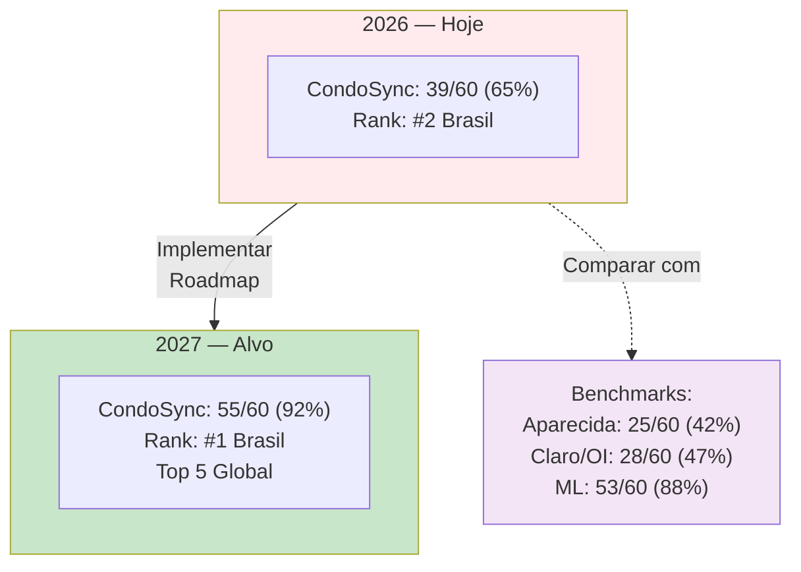

---

## 6. FEATURES MATRIZ

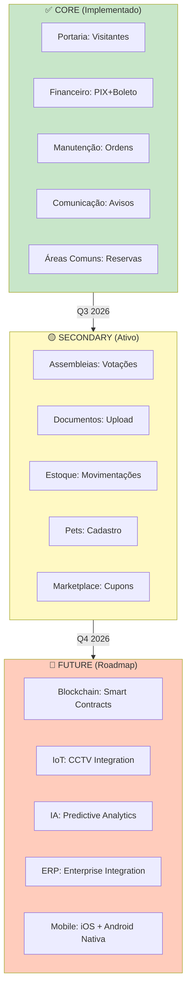

---

## 7. REVENUE MODEL (SaaS)

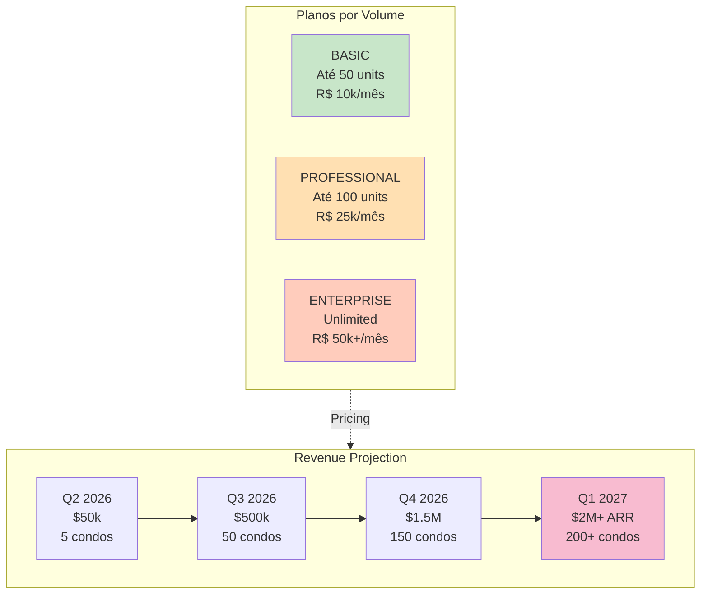

---

## 8. TEAM & HIRING

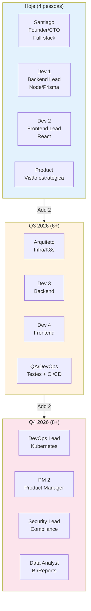

---

## 9. DEPENDENCIES & RISKS

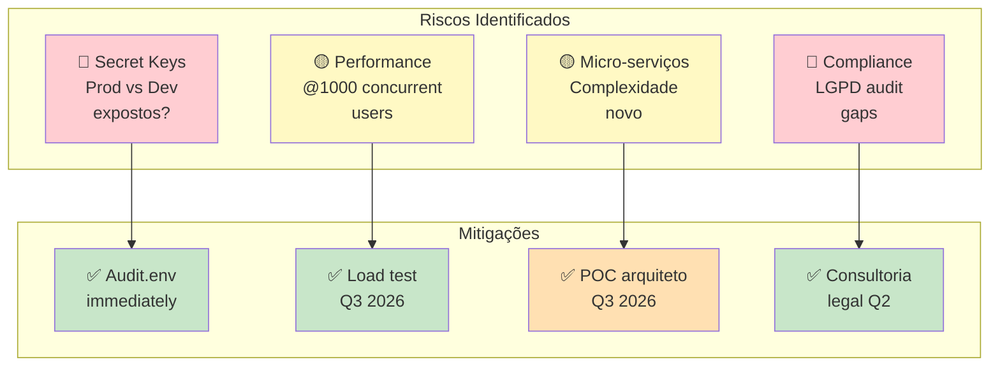

---

## 10. DECISION MATRIX

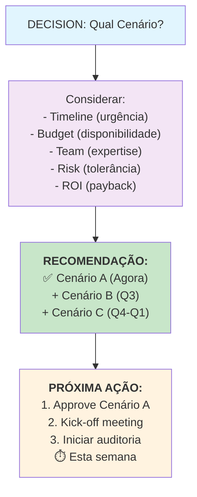

---

## 11. SUCCESS METRICS TIMELINE

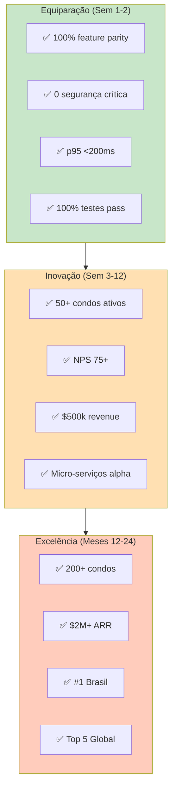

---

## Legenda

```
✅ Completado
🟡 Em progresso/Médio risco
🔴 Crítico/Alto risco
⏭️ Próximo passo
💰 Custo
⏱️ Timeline
📊 Métrica
🎯 Objetivo
```

---

**Documentos preparados para análise e aprovação executiva.**
